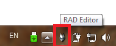
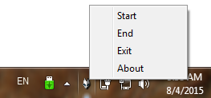
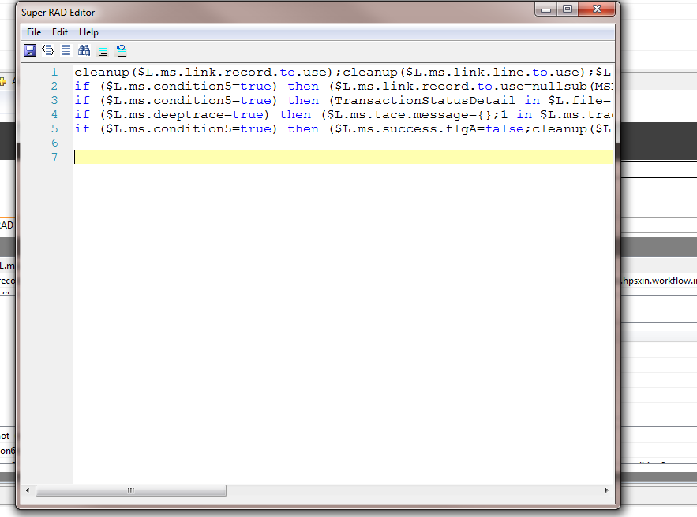
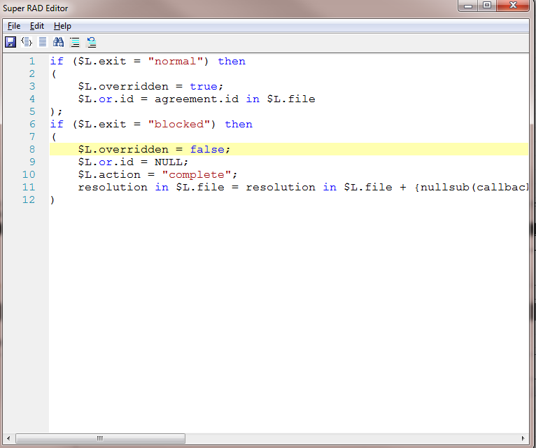
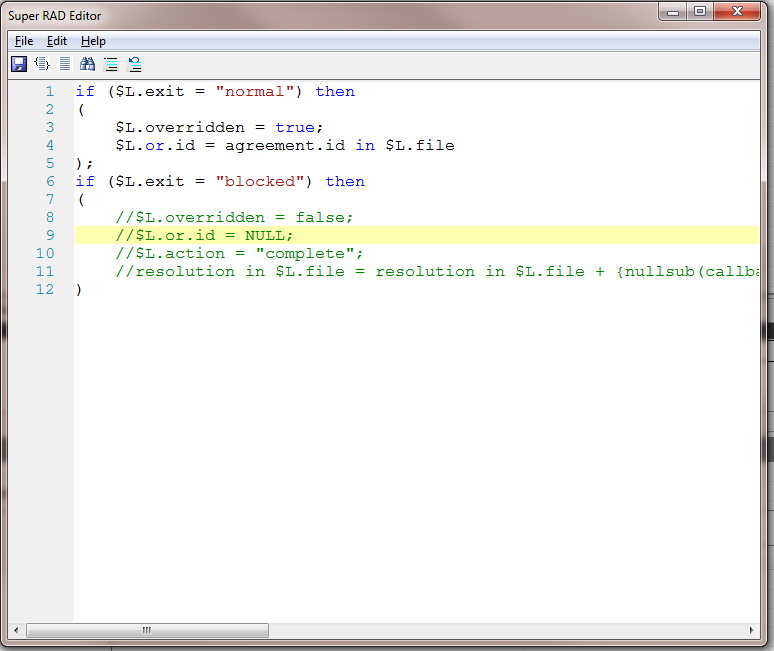

# Service Manager RAD Editor #

This is a editor tool for coding/viewing Service Manager RAD program.

## How to use##
- Download **SM RAD Editor Runable.zip** and unzip it to anywhere in your local computer. And you will see the executable file **EditorStart.exe** 
- Run **EditorStart.exe** and you will see there is an mask icon on the computer status bar, as shown below:
	- 
- You can Start / Stop the editor from the context menu of the icon.(When start the editor, ensure the Service Manager Client is running).
	-  
- Go to service Manager, and select any line of code and press **Control + R** to open the editor, or double click the text box and open it from the context menu
	-  

- From the editor, you can 
	- Format the code.
	- Edit the code in multi-line style.
	- Serialize the code into single line, and save it back to Service Manager.
	- Comments out pieces of code (because Service Manager RAD does not support comments, when you comments out piece of code, when save the code back to Service Manager it converts to an assignment statement)

		> $L.comments.AutoGenerated.byEDITOR="1 in agreement.ids in $L.file = agreement.id in $L.file".
	- Or uncomments it.

##This editor can:##
- Enable you code RAD programs in modern way. Support Key Word High-Lighting, line breaking, indent and especially comments.
- Enable you View Lines of code one time instead of read it line by line.
- Enable you comments /uncomments pieces of code.

## Snap shoot##
1. Formated code:
	- 
2. Comments out piece of code
	- 

## Traps, Known Issues..##
1.  It cannot extract code from muli-line input control, like initial expression of Process record.
2.  You can extract mulit lines of code one time from list control. But when you save it back to Service Manager, it save the code to the first item, but still keep the following lines of code as it was.
3.  How to extract mulit lines of code from list control?
	1.  Select any line of code, but ensure the edit cursor is not shown within it.
	2.  Press  **Control + R**
4. The editor is pop as model window, which means When the editor is open you cannot touch the Service Manager interface anymore before the editor closed.
5.  I also created a stand-alone RAD editor with the same functionality to avoid problem of 4#. [https://github.com/daizhen/netRADEditor](https://github.com/daizhen/netRADEditor "netRADEditor")

##Supported Service Manager Versions##
From 7.X to the latest 9.40